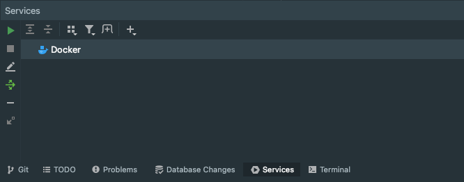
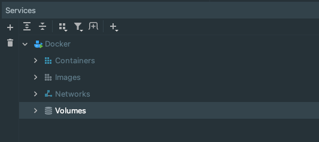
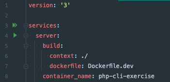
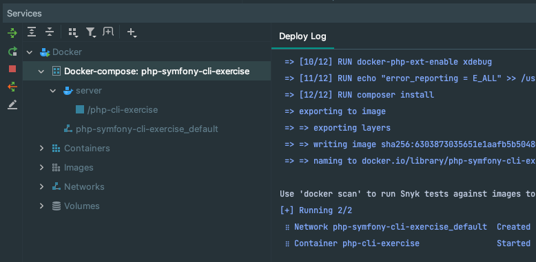

# php-symfony-cli-exercise

This project provides a starter CLI to complete exercises to practice coding in PHP.

## Instructions

1. Fork this repo in [GitHub](https://github.com/kronning6/php-symfony-cli-exercise/fork) to your personal GitHub
2. Clone your new repo and open it in PhpStorm
3. For this exercise, you'll run Docker from within PhpStorm. To do this, see the instructions below
4. With your Docker container running execute `./cli.sh help`. You'll see an example command that can be run
5. Run `./cli.sh echo:name`
6. Create your own commands in the [src/](src) folder
7. Make sure to run `docker exec -it php-cli-exercise composer install` after adding a new command

---
## Instructions on setting up Docker in PhpStorm

### Services 

Open the `Services` tab:

If you haven't setup Docker before in PhpStorm, click the `+` button and select "Docker Connection" and "Docker for Mac"
in the dialog window.

### Connect to Docker

Ensure you have Docker Desktop running already (i.e. Cmd + space bar, then `Docker.app`. You can close the window after
Docker Desktop starts up). Click the play button and you should now see this.

### Open `docker-compose.yml` and click the double play button

### Container stood up via Docker Compose

